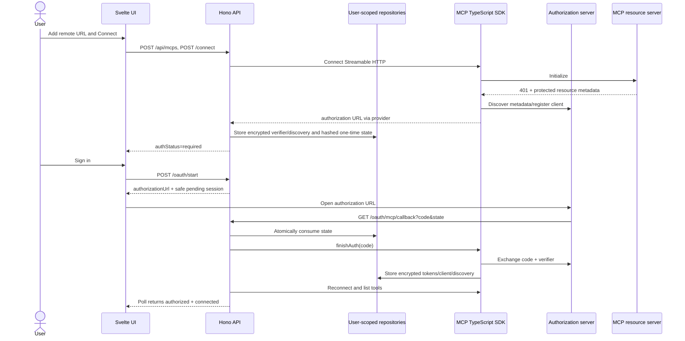

# MCP OAuth architecture and API contract

This is the implementation contract for MEA-27 through MEA-33. The TypeScript backend owns OAuth and the frontend consumes only safe lifecycle state.

## Scope and ownership

OAuth applies only to Streamable HTTP MCP servers. Stdio keeps environment-based credentials; no-auth HTTP and static bearer HTTP retain their existing behavior. Every server, tool, OAuth credential, pending authorization session, and chat-time selection is owned by one authenticated `userId`. Repository calls take both `userId` and record ID; a record owned by someone else is indistinguishable from a missing record.

The backend owns protected-resource and authorization-server discovery, dynamic client registration, PKCE, state, token exchange/refresh, encrypted persistence, transport construction, reconnect, and tool discovery. The frontend owns explicit user interaction, opening the returned authorization URL, bounded status polling, and presentation. It never receives tokens, client secrets, authorization codes, PKCE verifiers, discovery documents, or raw state.

The implementation uses `@modelcontextprotocol/sdk` 1.29.0's `OAuthClientProvider`, `StreamableHTTPClientTransport`, `UnauthorizedError`, and `finishAuth(code)`. It does not implement OAuth protocol primitives. Client registration follows the specification order supported by the installed SDK: pre-registered client information, HTTPS Client ID Metadata Document through `clientMetadataUrl`, then Dynamic Client Registration when advertised.

## End-to-end sequence



## State contract

The declared TypeScript types are in `server/src/mcp/types.ts`; transitions are executable in `server/src/mcp/oauth-contract.ts`.

| Event | `authStatus` | `connectionStatus` | Session/result |
|---|---|---|---|
| Disabled | unchanged | `disabled` | no active transport |
| No-auth/bearer connect succeeds | `not_required` | `connected` | tools discovered |
| OAuth challenge | `required` | `error` | sign-in action available |
| OAuth start | `pending` | `connecting` | one pending session |
| Callback succeeds | `authorized` | `connected` | state consumed, tools discovered |
| Consent denied | `required` | `error` | session `denied` |
| State expires | `required` | `error` | session `expired` |
| Cancel | `required` | `error` | session `cancelled` |
| State replay/mismatch | unchanged | unchanged | callback rejected; no state or credential mutation |
| Refresh fails | `required` | `error` | invalid tokens cleared |

`authMode` is `auto | none | bearer | oauth`; `authStatus` is `not_required | required | pending | authorized | error`; `connectionStatus` is `disabled | connecting | connected | error`. Authorization sessions are `pending | authorized | denied | expired | cancelled | error`. Polling stops on every non-pending session status, a client timeout, or teardown.

Only one pending session is allowed per user/server. Starting again atomically cancels the prior session and creates a new one. State is at least 256 random bits, stored only as SHA-256, expires after ten minutes, and is consumed atomically before exchanging the code. Expired, cancelled, consumed, mismatched, or replayed state cannot mutate credentials.

## API contract

All `/api/mcps` routes require the normal application bearer credential and derive `userId` from middleware. IDs never confer ownership.

| Method and path | Request | Success |
|---|---|---|
| `GET /api/mcps` | none | `McpServerRecord[]` |
| `POST /api/mcps` | `CreateMcpServerInput` | `201 McpServerRecord` |
| `PATCH /api/mcps/:id` | `UpdateMcpServerInput` | `McpServerRecord` |
| `DELETE /api/mcps/:id` | none | `{ "ok": true }` |
| `POST /api/mcps/:id/connect` | none | `McpServerRecord` |
| `POST /api/mcps/:id/oauth/start` | none | `{ "session": McpOAuthSessionRecord }` |
| `GET /api/mcps/:id/oauth/session` | none | `{ "session": McpOAuthSessionRecord | null }` |
| `POST /api/mcps/:id/oauth/cancel` | none | `McpServerRecord` |
| `POST /api/mcps/:id/disconnect` | none | `McpServerRecord` |
| `POST /api/mcps/:id/reconnect` | none | `McpServerRecord` |
| `PATCH /api/mcps/:id/tools/:toolName` | `{ "enabledForNewSessions": boolean }` | `McpToolRecord` |

An API server record adds the fields below and contains no secret-shaped fields:

```json
{
  "authMode": "oauth",
  "authStatus": "pending",
  "connectionStatus": "connecting",
  "oauthCredentialsConfigured": false,
  "oauthSession": {
    "id": "session-id",
    "serverId": "server-id",
    "status": "pending",
    "authorizationUrl": "https://authorization.example/authorize?...",
    "expiresAt": 1783790000000,
    "error": null
  },
  "error": null
}
```

Errors use `{ "error": string, "code"?: string }`: `400` malformed input/configuration, `401` invalid application credential, `404` missing or wrong-owner record, `409` invalid lifecycle transition, `410` expired/consumed authorization state, `429` rate limited, and `500/502` safe backend/provider failure.

The public `GET /oauth/mcp/callback` route is outside `/api/*`. Its only authority is a valid one-time state. It accepts `state` plus exactly one of `code` or OAuth `error`; it never accepts application bearer credentials as authority, arbitrary redirect targets, server IDs, or user IDs. It returns minimal HTML with `Cache-Control: no-store`, `Pragma: no-cache`, `Referrer-Policy: no-referrer`, `X-Content-Type-Options: nosniff`, and CSP `default-src 'none'; style-src 'unsafe-inline'; base-uri 'none'; form-action 'none'; frame-ancestors 'none'`. The HTML and logs contain no query values.

The callback is public because an external authorization server, not the signed-in application client, performs the redirect. Public does not mean unauthenticated authority: a callback can act only after atomically consuming the high-entropy state hash bound to one stored user/server/session. Application bearer headers, extra user/server parameters, and redirect parameters are ignored. The callback has a dedicated IP rate-limit bucket (`RATE_LIMIT_OAUTH_CALLBACK_PER_MIN`) and is excluded from request URL logging.

## Persistence and migration

`mcp_servers` gains non-null `user_id` and `auth_mode`. Existing rows migrate to the installation's bootstrap user and derive `auth_mode`: stdio/no bearer becomes `none`, HTTP with bearer becomes `bearer`, and other HTTP becomes `auto`. `mcp_tools` remains server-owned and inherits user ownership through the server foreign key.

`mcp_oauth_credentials` is one-to-one with the server and stores a canonical resource URL plus encrypted JSON blobs for tokens, client information, and discovery. `mcp_oauth_sessions` stores user/server ownership, state hash, encrypted PKCE verifier, safe status/error, timestamps, and expiry. Authorization URLs are returned once and are not persisted because their query contains raw state. Server deletion cascades through tools, credentials, and sessions. Both SQLite and Postgres implement the same repository contract and bounded expiry cleanup.

OAuth persistence fails closed without `ENCRYPTION_KEY`; legacy bearer behavior remains compatible in development, while production already requires the key. `PUBLIC_BASE_URL` builds the single callback URI. Development permits loopback HTTP; production requires an HTTPS origin with no path/query/fragment. Redirect configuration is validated before OAuth begins.

### Final schema

- `mcp_servers`: `id`, non-null `user_id`, `auth_mode`, transport/configuration, encrypted-or-legacy bearer field, enabled/status/error, timestamps. New and migrated writes cannot omit ownership.
- `mcp_tools`: server foreign key with cascade deletion; ownership is enforced through the parent server on every query and mutation.
- `mcp_oauth_credentials`: primary/foreign `server_id`, `user_id`, canonical `resource_url`, AES-GCM encrypted `tokens`, `client_information`, and `discovery`, timestamps.
- `mcp_oauth_sessions`: `id`, `server_id`, `user_id`, unique SHA-256 `state_hash`, AES-GCM encrypted `code_verifier`, safe status/error, expiry/consumption timestamps. Raw state and authorization URLs are never stored.

SQLite and Postgres startup migrations add ownership/auth mode, assign legacy records to the earliest bootstrap user, derive `none`/`bearer`/`auto`, and refuse startup if records cannot be assigned safely. Existing stdio, no-auth, and bearer rows therefore retain behavior. Older SQLite databases use enforcement triggers after backfill because SQLite cannot add a non-null foreign-key column in place; fresh databases use a native non-null constraint.

Before rollback, back up the database and `ENCRYPTION_KEY`. The added columns/tables are additive, but an older multi-user binary must not be run against the migrated database because its global MCP queries do not enforce ownership. Remove OAuth servers/sessions before any deliberate schema downgrade; bearer and no-auth records remain readable by current and newer versions.

## Trust boundaries and security invariants

- Browser/UI: untrusted for credentials; receives only authorization URLs and safe status.
- Authenticated API: maps the application bearer credential to `userId`; every query and mutation is scoped by that ID.
- Public callback: trusts only atomically consumed, hashed, short-lived state tied to the expected user/server/session.
- OAuth/MCP network: discovered metadata is validated and tokens remain bound to the configured canonical resource URL.
- Database: secrets are AES-256-GCM encrypted using the existing crypto helper; plaintext OAuth writes are forbidden.
- Logs/errors/artifacts: never include token, code, raw state, verifier, client secret, authorization URL query, or discovery secret material.

## Frontend ownership and integration

`McpServerService` is the sole frontend lifecycle client. A component calls `connect`, presents `Sign in` only after an explicit response, calls `startOAuth` from that user action, opens the returned URL, and subscribes to bounded polling. On reload it loads the server/session and resumes polling when status is `pending`. The service refreshes chat-availability stores after terminal transitions; components never poll or handle callback values themselves.

The typed service surface is `loadServers`, `createServer`, `updateServer`, `connect`, `startOAuth`, `getOAuthSession`, `pollOAuth`, `restorePendingOAuth`, `cancelOAuth`, `disconnect`, `reconnect`, `setToolEnabled`, and `dispose`. `openAuthorization` is intentionally separate from `startOAuth` so a component can call it only inside a click/keyboard handler and retain the returned URL as a popup-blocked fallback. `pollOAuth` defaults to one-second intervals and a two-minute deadline; it returns `terminal`, `timeout`, or `cancelled` and stops on authorization, denial, expiry, cancellation, error, explicit cancellation, external abort, or teardown. `restorePendingOAuth` re-reads authenticated backend state; nothing sensitive or authoritative is restored from browser storage.

Setup-wizard integration stays small:

```ts
const session = await mcpServerService.startOAuth(server.id); // click handler
const popupOpened = mcpServerService.openAuthorization(session);
fallbackUrl = popupOpened ? null : session.authorizationUrl;
const polling = mcpServerService.pollOAuth(server.id);
const outcome = await polling.promise;
// On component teardown: polling.cancel() or mcpServerService.dispose().
```

On management-screen mount, call `restorePendingOAuth()` once. Service change notifications refresh the chat server store and remove selections that are disabled or no longer connected. Backend errors are reduced to a fixed actionable set (backend authentication, ownership/not-found, stale transition, callback configuration, encrypted storage, rate limit, or generic connection failure); raw provider bodies are never displayed.

The shipped management location is **Settings → Connections → MCP servers**. `McpServersSettings.svelte` owns the three-stage connection/authentication/ready wizard, lifecycle actions, tool defaults, and popup fallback. `McpDrawer.svelte` is selection-only: it selects already-connected servers for a new chat, preserves the active-chat lock, and links to the canonical settings screen. The legacy MCP form in `Integrations.svelte` is hidden on that screen, so there is only one full management surface.

## SDK provider and manager lifecycle

The installed `@modelcontextprotocol/sdk` 1.29.0 `OAuthClientProvider` callbacks map to persistence as follows:

| SDK callback | Persistent behavior |
|---|---|
| `clientInformation` / `saveClientInformation` | Read/write encrypted dynamic registration data for one user/server/resource |
| `tokens` / `saveTokens` | Read/write encrypted access and rotated refresh tokens |
| `discoveryState` / `saveDiscoveryState` | Read/write encrypted protected-resource and authorization-server discovery after resource validation |
| `state` | Generate 256 random bits; persist only SHA-256 when the redirect is captured |
| `saveCodeVerifier` / `codeVerifier` | Encrypt the verifier in the one pending authorization session and restore it for callback exchange |
| `redirectToAuthorization` | Capture the URL for the API response; atomically replace the prior pending session; never open a browser or persist the URL |
| `invalidateCredentials` | Clear only the requested token/client/discovery scope, cancel a verifier session, or delete all credentials |
| `validateResourceURL` | Require the SDK server, discovered resource, configured server, stored credentials, user, and server ID to remain the same canonical HTTP(S) resource |

`McpManager` passes the provider only to Streamable HTTP `auto`/`oauth` transports. Static bearer uses its existing header path and stdio retains environment credentials. A challenge creates `pending`; `finishAuth(code)` exchanges and persists tokens before reconnect/tool discovery; restart recreates the provider from encrypted records; a 401 refresh persists rotated tokens. Refresh failure clears invalid tokens and creates a new actionable pending authorization. Shutdown and disconnect use bounded best-effort client close.

Manager logs contain server ID and error class only. API-visible errors are allowlisted operational messages; authorization URLs, provider response bodies, codes, state, verifiers, tokens, and client secrets are never passed to the logger. Discovery/resource mismatch is reported without echoing either URL.

## Rollout order and verification

1. MEA-27 contract and executable transitions.
2. MEA-28 user-scoped encrypted persistence and migrations.
3. MEA-30 SDK provider/manager integration.
4. MEA-32 lifecycle routes and public callback.
5. MEA-29 typed frontend service against the live routes.
6. MEA-31 canonical accessible management flow.
7. MEA-33 deterministic OAuth/MCP fixture and end-to-end security suite.

Each layer must preserve stdio, no-auth HTTP, static bearer, discovery, enablement, and chat-selection behavior. Contract changes update this document and its executable types before downstream code.

The executable requirement-to-test matrix, local fixture commands, safe-debugging rules, and release gates are maintained in [MCP OAuth test and release guide](mcp-oauth-testing.md).

## Operations

### Add and use an MCP server

Open **Settings → Connections**, then find **MCP servers**. For a remote server, choose **Remote URL**, paste its Streamable HTTP endpoint, edit the inferred name if needed, and choose **Continue**. Leave authentication on **Detect automatically** unless the server explicitly documents no authentication or a static bearer token. If OAuth is required, choose **Sign in**, finish consent in the browser, return to the app, review the discovered tools, and choose **Use in new chat**. Tokens, authorization codes, and client secrets are never shown in the app.

For a local server, choose **Local command**, enter the executable and arguments, and connect. For a static bearer server, expand **Advanced: static bearer token**; the token is submitted directly to encrypted backend storage and is never returned to the frontend. Existing servers can be retried, disconnected, re-enabled, edited, removed, or assigned default tools from this same screen. The chat MCP drawer only selects connected servers, and selection is locked after the first message.

If a popup is blocked, use **Open authorization** or **Copy link** in the waiting panel. If consent is denied or expires, choose **Sign in** again; retry always creates a fresh one-time authorization session. A discovery failure usually means the configured MCP URL or its OAuth metadata is wrong. A reconnect that returns to **Sign-in required** means refresh failed safely and fresh authorization is required.

- Redirect mismatch: verify `PUBLIC_BASE_URL` is the externally reachable origin and the provider registered `<origin>/oauth/mcp/callback` exactly.
- Discovery failure: verify the MCP resource metadata and authorization-server metadata endpoints; do not bypass resource validation.
- Expired/replayed state: start sign-in again; never reuse the callback URL.
- Refresh failure: the server returns to `Sign-in required`; reconnect after signing in.
- Callback unreachable: expose the configured HTTPS callback origin and keep the callback outside application bearer middleware.

### Callback deployment checklist

1. Set `PUBLIC_BASE_URL` to one origin only. Production rejects non-HTTPS, credentials, path, query, and fragment; development permits only HTTPS or loopback HTTP (`localhost`, `127.0.0.1`, or `::1`).
2. Register the exact deterministic redirect URI `<origin>/oauth/mcp/callback` with the authorization server. Never add provider- or browser-supplied return URLs.
3. Route that path publicly to the Hono backend without adding application bearer middleware. Preserve the backend's CSP, no-store, referrer, nosniff, and frame-denial headers.
4. Configure `RATE_LIMIT_OAUTH_CALLBACK_PER_MIN`. Enable `TRUST_PROXY` only behind a trusted proxy that overwrites forwarding headers.
5. Keep `ENCRYPTION_KEY` stable and backed up. OAuth start fails before redirect when either required configuration value is unsafe or missing.

Troubleshooting remains intentionally value-free: use server ID, safe lifecycle status, and error class. Do not paste callback URLs into logs or tickets because they contain authorization code/state. An expired, cancelled, malformed, or replayed callback returns a generic failure page; start sign-in again. Discovery/resource mismatch requires fixing server metadata, never bypassing validation. A provider denial leaves the server in sign-in-required state and retry creates a new one-time session.

## Non-goals

Client-credentials grants, provider-specific workarounds, token revocation, MCP resources, MCP prompts, and embedded browsers are intentionally deferred.
